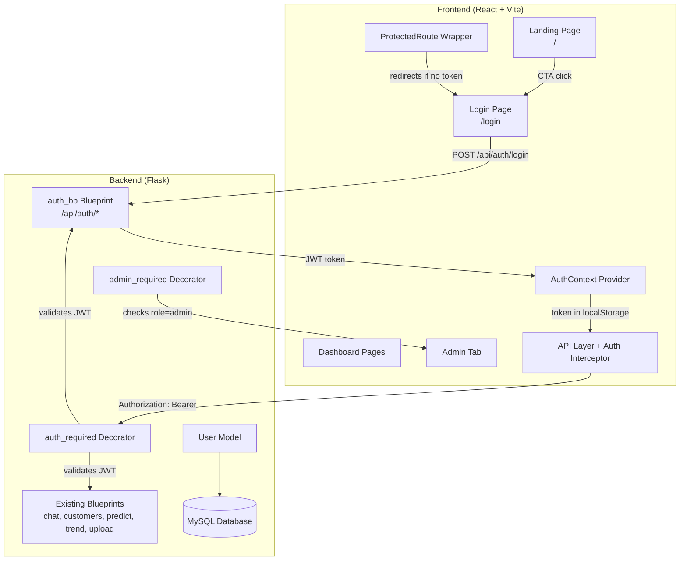
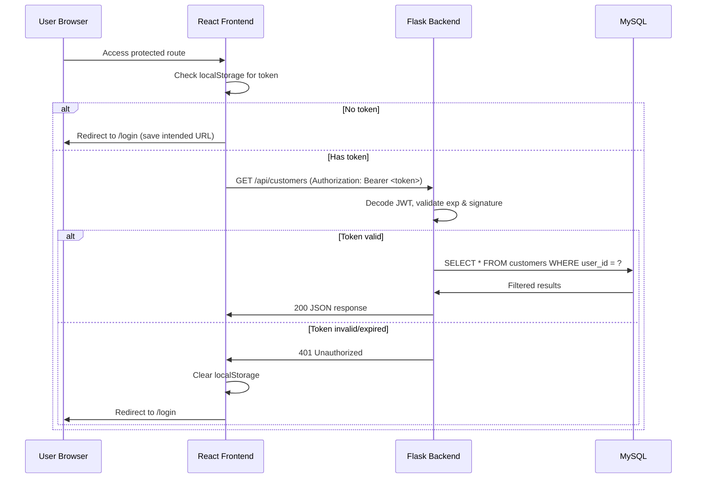
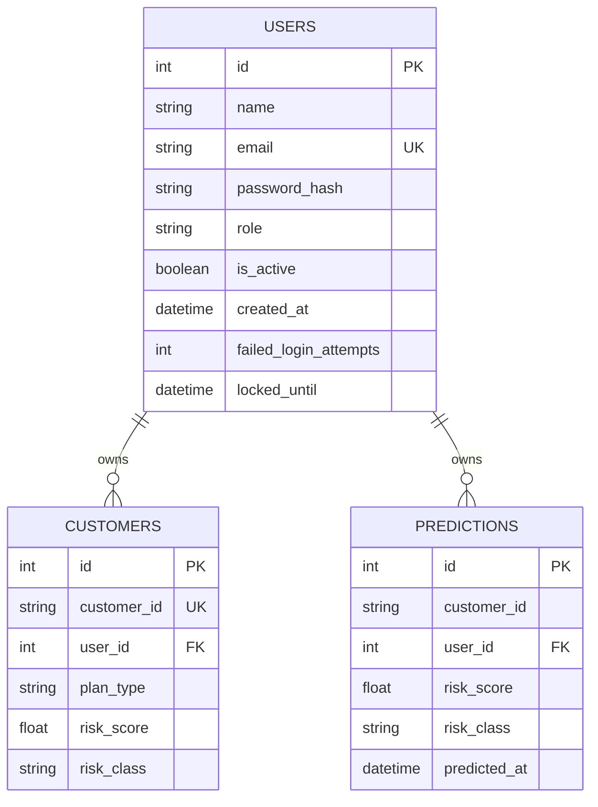

# Design Document: Landing Page, Login & Admin

## Overview

This design adds three core capabilities to the Churn Dashboard application:

1. **Public Landing Page** — A marketing-oriented page accessible without authentication that introduces the product and directs visitors to login.
2. **JWT-Based Authentication** — A complete login/logout system with session management, route protection, and rate limiting.
3. **Admin Panel** — A dashboard tab (visible only to admins) for user management and system statistics.

The design integrates with the existing Flask + React architecture by adding a new `auth` Blueprint on the backend, an `AuthContext` provider on the frontend, and a `User` SQLAlchemy model that shares the existing `Base` metadata. Existing data tables (`customers`, `predictions`) gain a nullable `user_id` foreign key for per-user data isolation.

### Key Design Decisions

| Decision | Choice | Rationale |
|----------|--------|-----------|
| Token storage | localStorage | Simple integration with existing fetch-based API layer; acceptable for internal tool |
| Password hashing | bcrypt (12 rounds) | Industry standard, resistant to brute force |
| Token format | JWT with HS256 | Stateless verification, no session store needed |
| Rate limiting | In-memory dict with TTL | Sufficient for single-server deployment; avoids Redis dependency |
| Admin seeding | Environment variables | Secure, follows 12-factor app principles |
| Data isolation | `user_id` FK column | Minimal schema change, backward-compatible with NULL for legacy data |

## Architecture



### Request Flow



## Components and Interfaces

### Backend Components

#### 1. User Model (`app/models/user.py`)

```python
class User(Base):
    __tablename__ = 'users'
    
    id = Column(Integer, primary_key=True, autoincrement=True)
    name = Column(String(100), nullable=False)
    email = Column(String(255), unique=True, nullable=False, index=True)
    password_hash = Column(String(255), nullable=False)
    role = Column(String(10), nullable=False, default='user')  # 'admin' | 'user'
    is_active = Column(Boolean, default=True)
    created_at = Column(DateTime, default=datetime.utcnow)
    failed_login_attempts = Column(Integer, default=0)
    locked_until = Column(DateTime, nullable=True)
```

#### 2. Auth Blueprint (`app/routes/auth_routes.py`)

| Endpoint | Method | Auth | Description |
|----------|--------|------|-------------|
| `/api/auth/login` | POST | Public | Authenticate user, return JWT |
| `/api/auth/logout` | POST | Required | Invalidate session (client-side) |
| `/api/auth/me` | GET | Required | Return current user profile |
| `/api/auth/users` | GET | Admin | List all users |
| `/api/auth/users` | POST | Admin | Create new user |
| `/api/auth/users/<id>` | PUT | Admin | Update user |
| `/api/auth/users/<id>/deactivate` | POST | Admin | Deactivate user |
| `/api/auth/users/<id>/activate` | POST | Admin | Activate user |
| `/api/auth/stats` | GET | Admin | System statistics |

#### 3. Auth Middleware (`app/middleware/auth.py`)

```python
def auth_required(f):
    """Decorator that validates JWT and injects current_user into request context."""
    
def admin_required(f):
    """Decorator that validates JWT AND checks role == 'admin'."""
```

#### 4. JWT Utility (`app/utils/jwt_utils.py`)

```python
def create_token(user: User) -> str:
    """Generate JWT with user_id, email, role, exp (24h)."""

def decode_token(token: str) -> dict | None:
    """Decode and validate JWT. Returns payload or None."""
```

#### 5. Rate Limiter (`app/utils/rate_limiter.py`)

```python
class LoginRateLimiter:
    """In-memory rate limiter: 5 attempts per email, 5-minute lockout."""
    
    def is_locked(self, email: str) -> bool: ...
    def record_failure(self, email: str) -> None: ...
    def reset(self, email: str) -> None: ...
```

### Frontend Components

#### 1. AuthContext (`src/contexts/AuthContext.jsx`)

```jsx
// Provides: user, token, login(), logout(), isAuthenticated, isAdmin
// Persists token to localStorage
// Auto-checks token validity on mount
```

#### 2. ProtectedRoute (`src/components/auth/ProtectedRoute.jsx`)

```jsx
// Wraps routes that require authentication
// Redirects to /login with returnUrl if not authenticated
```

#### 3. Landing Page (`src/pages/LandingPage.jsx`)

```jsx
// Public page with hero section, features grid, CTA button
// Redirects to dashboard if user already authenticated
```

#### 4. Login Page (`src/pages/Login.jsx`)

```jsx
// Email + password form with client-side validation
// Shows error messages from backend
// Redirects to dashboard (or saved returnUrl) on success
```

#### 5. Admin Page (`src/pages/Admin.jsx`)

```jsx
// Two sections: User Management + System Stats
// User list with create/edit/deactivate actions
// System info cards (active users, customers, predictions, chat sessions)
```

#### 6. API Layer Update (`src/api/index.js`)

```javascript
// Add auth interceptor: attach Bearer token to all requests
// Add 401 response handler: clear token + redirect to login
// Add auth API functions: login(), logout(), getMe(), getUsers(), etc.
```

### Interface Contracts

#### Login Request/Response

```json
// POST /api/auth/login
// Request:
{ "email": "user@example.com", "password": "password123" }

// Success Response (200):
{ "token": "eyJ...", "user": { "id": 1, "name": "Admin", "email": "admin@example.com", "role": "admin" } }

// Error Response (401):
{ "error": "Email atau password salah" }

// Locked Response (429):
{ "error": "Terlalu banyak percobaan. Coba lagi dalam 5 menit." }
```

#### User Management

```json
// GET /api/auth/users (Admin only)
// Response (200):
{ "users": [{ "id": 1, "name": "Admin", "email": "...", "role": "admin", "is_active": true, "created_at": "..." }] }

// POST /api/auth/users (Admin only)
// Request:
{ "name": "New User", "email": "new@example.com", "password": "securepass", "role": "user" }

// Response (201):
{ "user": { "id": 2, "name": "New User", "email": "new@example.com", "role": "user", "is_active": true } }
```

#### System Stats

```json
// GET /api/auth/stats (Admin only)
// Response (200):
{
  "active_users": 5,
  "inactive_users": 1,
  "total_customers": 1200,
  "total_predictions": 3500,
  "total_chat_sessions": 42
}
```

## Data Models

### Users Table (New)

| Column | Type | Constraints | Description |
|--------|------|-------------|-------------|
| id | INTEGER | PK, AUTO_INCREMENT | Unique user identifier |
| name | VARCHAR(100) | NOT NULL | User's full name |
| email | VARCHAR(255) | UNIQUE, NOT NULL, INDEX | Login email |
| password_hash | VARCHAR(255) | NOT NULL | bcrypt hashed password |
| role | VARCHAR(10) | NOT NULL, DEFAULT 'user' | 'admin' or 'user' |
| is_active | BOOLEAN | DEFAULT TRUE | Account active status |
| created_at | DATETIME | DEFAULT NOW | Registration timestamp |
| failed_login_attempts | INTEGER | DEFAULT 0 | Consecutive failed logins |
| locked_until | DATETIME | NULLABLE | Rate limit lock expiry |

### Schema Modifications to Existing Tables

#### customers table — add column:
```sql
ALTER TABLE customers ADD COLUMN user_id INTEGER NULL,
ADD CONSTRAINT fk_customers_user FOREIGN KEY (user_id) REFERENCES users(id);
```

#### predictions table — add column:
```sql
ALTER TABLE predictions ADD COLUMN user_id INTEGER NULL,
ADD CONSTRAINT fk_predictions_user FOREIGN KEY (user_id) REFERENCES users(id);
```

### Entity Relationship



### Default Admin Seeding Logic

On application startup (`init_db()`):
1. Check if `users` table has any rows
2. If empty, read `ADMIN_EMAIL` and `ADMIN_PASSWORD` from environment
3. If both are set, create admin user with bcrypt-hashed password
4. If either is missing, log warning and skip seeding


## Correctness Properties

*A property is a characteristic or behavior that should hold true across all valid executions of a system — essentially, a formal statement about what the system should do. Properties serve as the bridge between human-readable specifications and machine-verifiable correctness guarantees.*

### Property 1: JWT token contains correct claims

*For any* valid registered user with known id, email, and role, when the login function is called with correct credentials, the returned JWT SHALL decode to a payload containing that user's id, email, and role, with an expiration exactly 24 hours in the future.

**Validates: Requirements 2.1, 3.4**

### Property 2: Invalid credentials produce uniform error

*For any* email/password combination where the email is not registered OR the password does not match the stored hash, the login function SHALL return the same error message "Email atau password salah" regardless of which field is incorrect.

**Validates: Requirements 2.2**

### Property 3: Inactive account login rejection

*For any* user marked as `is_active = False`, when login is attempted with that user's correct email and password, the system SHALL reject the login and return an account-disabled error message.

**Validates: Requirements 2.8**

### Property 4: Rate limiting enforces lockout after threshold

*For any* email address, after exactly 5 consecutive failed login attempts, the system SHALL reject subsequent login attempts for that email for 5 minutes, even if the correct credentials are provided. After the lockout period expires, the system SHALL allow login again.

**Validates: Requirements 2.9**

### Property 5: Invalid tokens are rejected by protected endpoints

*For any* protected API endpoint and *for any* token that is missing, expired (past 24h), has an invalid signature, or is malformed, the endpoint SHALL return HTTP 401 with a JSON response containing an "error" field.

**Validates: Requirements 3.2, 3.3, 8.4**

### Property 6: Data ownership on upload

*For any* authenticated user uploading a CSV file, all resulting customer and prediction records SHALL be stored with that user's `user_id`. When the same user uploads a new CSV, their previous data SHALL be replaced entirely while other users' data remains unchanged. When two different users upload CSVs containing the same `customer_id` values, both datasets SHALL coexist independently.

**Validates: Requirements 4.1, 4.3, 4.7**

### Property 7: Data isolation on query

*For any* authenticated user querying the customers, predictions, or trend endpoints, the response SHALL contain only records where `user_id` matches the requesting user's id. No records belonging to other users SHALL appear in the response.

**Validates: Requirements 4.2, 4.6**

### Property 8: Valid user creation persists correctly

*For any* valid user creation input (name 1–100 characters, email with valid format and not already registered, password ≥ 8 characters, role in {"admin", "user"}), the admin create-user endpoint SHALL persist a new user with those fields, with the password stored as a bcrypt hash and `is_active = True`.

**Validates: Requirements 5.2**

### Property 9: Account activation round-trip

*For any* active user, deactivating then reactivating the account SHALL restore the user to active status with login ability equivalent to before deactivation. Conversely, while deactivated, the user SHALL be unable to login.

**Validates: Requirements 5.4, 5.5**

### Property 10: Non-admin users cannot access admin endpoints

*For any* user with `role = 'user'` (not admin), requests to any admin-only endpoint SHALL return HTTP 403 Forbidden, regardless of whether the request includes a valid JWT.

**Validates: Requirements 5.6**

### Property 11: Duplicate email rejection

*For any* email address that already exists in the users table, attempting to create a new user with that same email SHALL fail with an error indicating the email is already in use, without modifying the existing record.

**Validates: Requirements 5.7**

### Property 12: System statistics accuracy

*For any* database state, the admin stats endpoint SHALL return counts where: `active_users` equals the count of users with `is_active = True`, `inactive_users` equals the count with `is_active = False`, `total_customers` equals the total row count of the customers table, `total_predictions` equals the total row count of the predictions table, and `total_chat_sessions` equals the count of distinct `session_id` values in chat_history.

**Validates: Requirements 6.1, 6.2, 6.3, 6.4**

### Property 13: Password hashing round-trip

*For any* plaintext password, after hashing with bcrypt (cost factor ≥ 12), the `bcrypt.checkpw` function SHALL return `True` when given the original password, and `False` for any other distinct password string.

**Validates: Requirements 7.6**

## Error Handling

### Backend Error Responses

All backend errors follow a consistent JSON format:

```json
{ "error": "<human-readable message in Indonesian>" }
```

| Scenario | HTTP Status | Error Message |
|----------|-------------|---------------|
| Invalid credentials | 401 | "Email atau password salah" |
| Account disabled | 401 | "Akun Anda telah dinonaktifkan" |
| Rate limited | 429 | "Terlalu banyak percobaan. Coba lagi dalam 5 menit." |
| No/invalid token | 401 | "Token tidak valid atau sudah expired" |
| Forbidden (non-admin) | 403 | "Akses ditolak" |
| Duplicate email | 409 | "Email sudah digunakan" |
| Validation error | 422 | "Validasi gagal: <field details>" |
| Self-deactivation | 400 | "Admin tidak dapat menonaktifkan akun sendiri" |
| Internal error | 500 | "Terjadi kesalahan server" |
| Stats unavailable | 503 | "Data sistem tidak tersedia" |

### Frontend Error Handling

- **API interceptor**: All 401 responses trigger token cleanup and redirect to `/login`
- **Form validation**: Client-side validation before API calls (email format, password length)
- **Network errors**: Display "Tidak dapat terhubung ke server" with retry option
- **Loading states**: All async operations show loading indicators
- **Empty states**: Pages with no data show informative messages with navigation to upload

### Security Error Handling

- Never expose internal error details (stack traces, SQL errors) in API responses
- Log detailed errors server-side for debugging
- Generic "Email atau password salah" for all credential failures (prevents enumeration)
- Rate limiting response does not confirm whether the email exists

## Testing Strategy

### Property-Based Testing (PBT)

**Library**: [Hypothesis](https://hypothesis.readthedocs.io/) for Python backend tests

PBT is applicable for this feature because:
- Authentication logic has clear input/output behavior (credentials → token/error)
- Data isolation properties should hold universally across all users and all data
- Rate limiting has threshold-based behavior that varies with input count
- User CRUD validation should universally reject all invalid inputs

**Configuration**:
- Minimum 100 iterations per property test
- Each test tagged with: `Feature: landing-page-login-admin, Property {N}: {title}`

**Property tests to implement** (mapped to design properties):
1. JWT claim correctness (Property 1)
2. Uniform error on bad credentials (Property 2)
3. Inactive account rejection (Property 3)
4. Rate limit threshold behavior (Property 4)
5. Invalid token rejection (Property 5)
6. Upload data ownership (Property 6)
7. Query data isolation (Property 7)
8. Valid user creation (Property 8)
9. Activation round-trip (Property 9)
10. Admin access control (Property 10)
11. Duplicate email rejection (Property 11)
12. Stats accuracy (Property 12)
13. Password hash round-trip (Property 13)

### Unit Tests (Example-Based)

Unit tests cover specific examples, edge cases, and UI behavior:

- Landing page renders correct elements (hero, 3 features, CTA)
- Login form client-side validation (email format, password length)
- Authenticated user redirected away from login/landing
- Logout clears localStorage and redirects
- Admin tab appears only for admin role
- Admin cannot self-deactivate (edge case)
- Empty env vars skip admin seeding (edge case)
- Middleware internal error returns 500 without details (edge case)

### Integration Tests

- Full login flow: form → API → JWT → redirect → dashboard loads
- CSV upload → data visible only to uploader
- Admin create user → new user can login
- Token expiry → automatic redirect to login
- Page load time under 3 seconds with auth middleware

### Test Organization

```
backend/tests/
├── test_auth_properties.py    # Hypothesis property tests (Properties 1-13)
├── test_auth_unit.py          # Unit tests for auth logic
├── test_admin_unit.py         # Unit tests for admin endpoints
├── test_data_isolation.py     # Integration tests for data ownership
└── conftest.py                # Shared fixtures (test DB, test users)

frontend/src/__tests__/
├── LandingPage.test.jsx       # Landing page rendering
├── Login.test.jsx             # Login form + validation
├── ProtectedRoute.test.jsx    # Route protection behavior
├── AuthContext.test.jsx       # Auth context logic
└── Admin.test.jsx             # Admin panel rendering
```
